# LTI ATS — Resumen Ejecutivo de Diseño

> **Producto:** LTI ATS  
> **Versión:** 1.0  
> **Fecha:** 3 de mayo de 2026

---

## 1. Descripción del Software LTI

### ¿Qué es LTI ATS?

**LTI ATS** es un Applicant Tracking System de próxima generación desarrollado por la startup LTI. Transforma el proceso de reclutamiento en un flujo **inteligente, automatizado y basado en datos**, cubriendo el ciclo completo: desde la creación de una vacante hasta la contratación del candidato.

A diferencia de los ATS tradicionales que funcionan como repositorios pasivos de CVs, LTI ATS incorpora inteligencia artificial en cada etapa del proceso para reducir el tiempo de contratación, eliminar sesgos y mejorar la experiencia tanto del reclutador como del candidato.

### Valor Añadido

| Diferenciador | Descripción |
|---|---|
| **IA nativa en todo el flujo** | No es un add-on: el screening automático con scoring (0-100), la generación de descripciones de puesto optimizadas y la detección inteligente de duplicados son parte del core del producto. |
| **Publicación multicanal con un clic** | Publica simultáneamente en LinkedIn, Indeed, Glassdoor y otros portales, adaptando automáticamente el formato a cada canal. |
| **Experiencia del candidato como prioridad** | Aplicación en menos de 3 minutos, portal de seguimiento en tiempo real, y comunicaciones automáticas transparentes en cada etapa. |
| **Decisiones colaborativas basadas en datos** | Scorecards estructuradas, panel de decisión con feedback consolidado de todos los entrevistadores y métricas de calidad de contratación. |
| **Analytics predictivo** | Dashboards con KPIs en tiempo real, detección de cuellos de botella y estimación de tiempo de cierre basada en datos históricos. |

### Ventajas Competitivas frente a Greenhouse, Lever y Workday

| Aspecto | ATS Tradicionales | LTI ATS |
|---|---|---|
| Screening de CVs | Manual o con filtros básicos por keywords | IA con scoring multidimensional (skills, experiencia, educación, ubicación) |
| Tiempo para publicar en múltiples canales | 15-30 min por canal, uno por uno | < 30 segundos en todos los canales simultáneamente |
| Experiencia del candidato | Formularios largos (+15 campos), sin visibilidad | ≤ 5 campos, portal con estado en tiempo real, NPS objetivo ≥ 70 |
| Scheduling de entrevistas | Manual, emails ida y vuelta | Automático con detección de disponibilidad cruzada en calendarios |
| Modelo de pricing | Enterprise ($$$), implementación 3-6 meses | SaaS accesible, onboarding en días, enfocado en startups y mid-market |
| Compliance GDPR | Parcial, configuración manual | Privacy by design, derecho al olvido automatizado en < 72h |

---

## 2. Funciones Principales

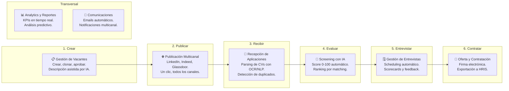

| Función | Descripción |
|---|---|
| **Gestión de Vacantes** | Creación con descripción asistida por IA, ciclo de vida completo (borrador → publicada → cerrada), clonación de vacantes previas y aprobaciones configurables. |
| **Publicación Multicanal** | Publicación simultánea en 5+ job boards con un clic. Adaptación automática del formato a cada plataforma. Tracking de efectividad por canal. |
| **Recepción y Parsing** | Parsing inteligente de CVs (PDF, DOCX, imágenes) con Amazon Textract + Comprehend. Extracción automática de skills, experiencia y educación. Detección de candidatos duplicados. |
| **Screening con IA** | Scoring automático de 0-100 por candidato basado en matching multidimensional contra los requisitos de la vacante. Labels automáticos y ranking en tiempo real. |
| **Pipeline Kanban** | Vista drag-and-drop con etapas configurables. Acciones masivas (mover, rechazar, contactar). Talent pool para futuras vacantes. |
| **Evaluaciones Técnicas** | Banco de preguntas propio + integración con HackerRank, Codility y TestGorilla. Envío automático con deadline y scoring integrado al perfil. |
| **Entrevistas** | Programación automática con sincronización de calendarios (Google, Outlook). Scorecards estructuradas. Panel de decisión colaborativa con feedback consolidado. |
| **Ofertas y Contratación** | Generación de ofertas con templates, cadena de aprobación, firma electrónica (DocuSign) y exportación a HRIS (Workday, SAP, BambooHR). |
| **Comunicaciones** | Templates de email con variables dinámicas. Triggers automáticos por cambio de etapa. Historial completo por candidato. Multicanal: email, SMS, push, in-app. |
| **Analytics** | Dashboard ejecutivo con KPIs (time-to-hire, cost-per-hire, source effectiveness). Reportes exportables. Detección de cuellos de botella. Análisis predictivo. |

---

## 3. Lean Canvas

Lean Canvas de Ash Maurya adaptado para LTI ATS, renderizado **en Mermaid** (`flowchart`). Se previsualiza en GitHub, GitLab, Notion, VS Code (extensión Mermaid) o en [mermaid.live](https://mermaid.live).

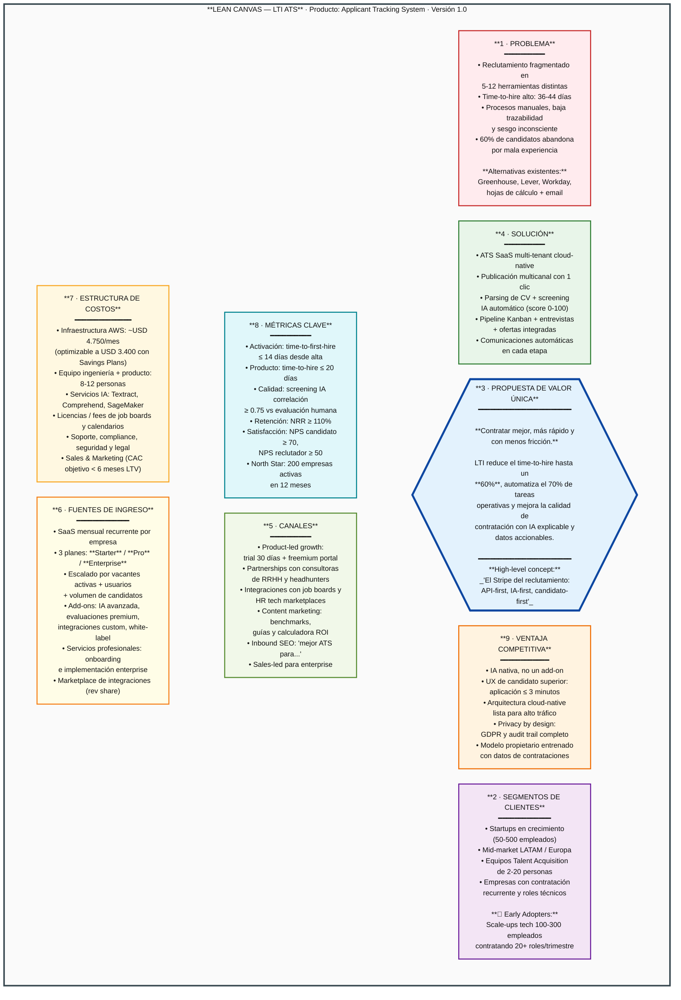

> **Cómo leer el canvas:** los números (1-9) siguen el orden recomendado por Ash Maurya para completarlo: primero el problema y los segmentos (1-2), luego la propuesta de valor única (3), después la solución y canales (4-5), y por último el modelo económico (6-7), métricas (8) y ventaja competitiva (9).

---

## 4. Casos de Uso Principales (Top 3)

### 4.1 Caso de Uso 1 — Aplicar a Vacante con Screening Automático

Este es el caso de uso más crítico del sistema: representa el momento en que un candidato entra al pipeline y el sistema genera valor inmediato mediante parsing e IA.

**Actores:** Candidato (primario), Sistema de IA (secundario), Reclutador (beneficiario)

**Flujo:**
1. El candidato accede al portal y selecciona una vacante.
2. Completa un formulario de máximo 5 campos y sube su CV.
3. El sistema parsea el CV con Textract (OCR) y Comprehend (NLP), extrayendo skills, experiencia y educación.
4. El sistema detecta si el candidato ya existe (duplicados por email o fuzzy matching).
5. El candidato responde killer questions eliminatorias (si están configuradas).
6. El sistema registra la aplicación y envía confirmación instantánea.
7. El motor de IA genera un score de matching (0-100) contra los requisitos de la vacante.
8. El candidato aparece rankeado automáticamente en el pipeline Kanban del reclutador.

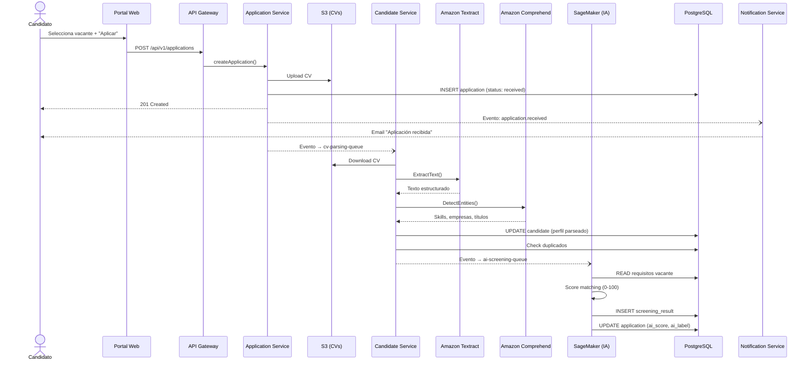

---

### 4.2 Caso de Uso 2 — Programar Entrevista con Decisión Colaborativa

Cubre el flujo completo desde que un candidato pasa a la etapa de entrevistas hasta que el hiring manager toma la decisión final.

**Actores:** Reclutador (primario), Hiring Manager (primario), Candidato (participante), Servicio de Calendario (secundario)

**Flujo:**
1. El reclutador mueve al candidato a la etapa "Entrevista" en el pipeline Kanban.
2. Selecciona los entrevistadores del panel.
3. El sistema consulta disponibilidad cruzada en Google Calendar / Outlook.
4. Propone 3 bloques horarios al candidato.
5. El candidato elige un horario; el sistema crea el evento en todos los calendarios.
6. Se programan recordatorios automáticos (24h y 1h antes).
7. Tras la entrevista, cada entrevistador completa un scorecard estructurado.
8. El sistema consolida feedback y notifica al hiring manager.
9. El hiring manager revisa scores, comentarios y recomendaciones en el panel de decisión.
10. Registra su decisión final (contratar / rechazar / segunda ronda).
11. El sistema actualiza el pipeline y dispara la comunicación automática.

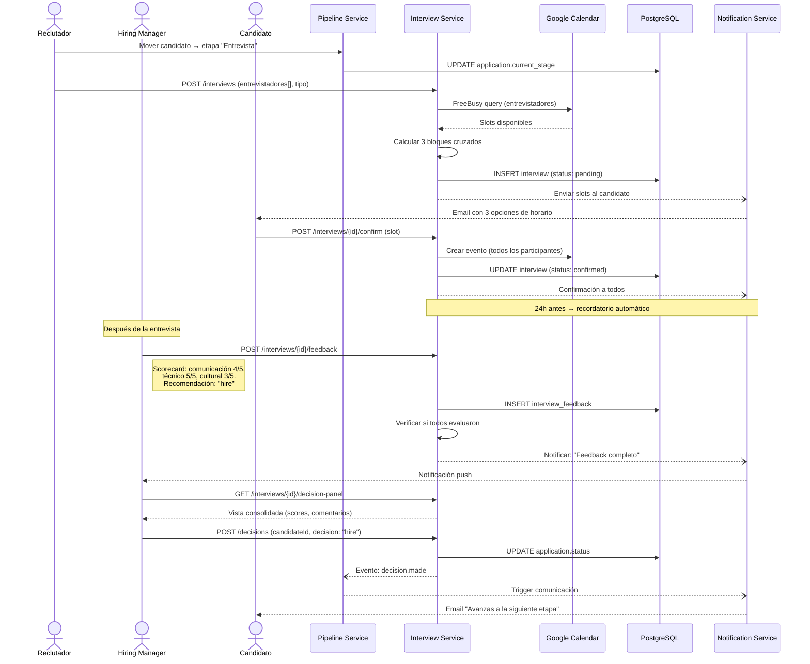

---

### 4.3 Caso de Uso 3 — Crear y Publicar Vacante Multicanal

Cubre el flujo desde que surge la necesidad de contratar hasta que la vacante está visible en todos los canales de empleo.

**Actores:** Reclutador (primario), Hiring Manager (aprobador), Sistema de IA (genera descripción), Job Boards (receptores)

**Flujo:**
1. El reclutador crea una nueva vacante ingresando título, departamento, ubicación y requisitos clave.
2. El sistema de IA genera una descripción optimizada para atracción de talento y SEO.
3. El reclutador revisa, ajusta y confirma.
4. Define el workflow del pipeline (etapas del proceso) o usa uno predefinido.
5. Envía para aprobación del hiring manager.
6. El hiring manager aprueba.
7. El reclutador selecciona los canales de publicación (LinkedIn, Indeed, Glassdoor, página de carreras).
8. El sistema publica simultáneamente en todos los canales, adaptando el formato a cada uno.
9. Se confirma la publicación con enlaces y se inicia la recepción de aplicaciones.

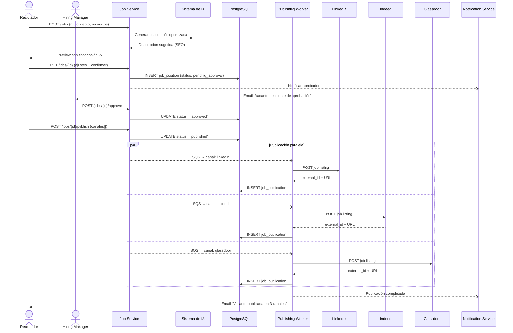

---

## 5. Modelo de Datos

### 5.1 Diagrama Entidad-Relación

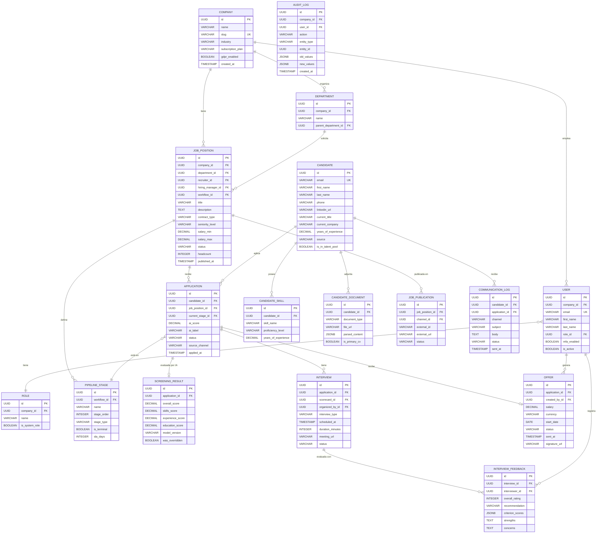

### 5.2 Entidades Principales — Resumen de Atributos

| Entidad | Atributos Clave | Relaciones |
|---|---|---|
| **COMPANY** | id (UUID PK), name, slug (UK), industry, subscription_plan, gdpr_enabled | 1:N → USER, DEPARTMENT, JOB_POSITION |
| **USER** | id (UUID PK), email (UK), first_name, last_name, role_id (FK), mfa_enabled, is_active | N:1 → COMPANY, ROLE. 1:N → INTERVIEW_FEEDBACK, OFFER |
| **JOB_POSITION** | id (UUID PK), title, description, contract_type, seniority_level, salary_min/max, status, headcount | N:1 → COMPANY, DEPARTMENT. 1:N → APPLICATION, PIPELINE_STAGE, JOB_PUBLICATION |
| **CANDIDATE** | id (UUID PK), email (UK), first_name, last_name, current_title, years_of_experience, is_in_talent_pool | 1:N → APPLICATION, CANDIDATE_SKILL, CANDIDATE_DOCUMENT |
| **APPLICATION** | id (UUID PK), ai_score, ai_label, status, source_channel, applied_at | N:1 → CANDIDATE, JOB_POSITION, PIPELINE_STAGE. 1:N → INTERVIEW, 1:1 → SCREENING_RESULT, OFFER |
| **INTERVIEW** | id (UUID PK), interview_type, scheduled_at, duration_minutes, status, meeting_url | N:1 → APPLICATION. 1:N → INTERVIEW_FEEDBACK |
| **SCREENING_RESULT** | id (UUID PK), overall_score, skills_score, experience_score, education_score, model_version | 1:1 → APPLICATION |
| **OFFER** | id (UUID PK), salary, currency, start_date, status, signature_url | 1:1 → APPLICATION |

---

## 6. Diseño del Sistema a Alto Nivel

### 6.1 Descripción de la Arquitectura

LTI ATS utiliza una **arquitectura de microservicios cloud-native** desplegada en **AWS**, diseñada para alta disponibilidad, escalabilidad automática y procesamiento asíncrono de tareas intensivas (parsing de CVs, scoring con IA).

**Principios de diseño:**

- **Microservicios por dominio:** Cada bounded context del negocio es un servicio independiente con su propia responsabilidad, desplegable y escalable de forma autónoma.
- **Arquitectura hexagonal interna:** Cada microservicio sigue Ports & Adapters, aislando el dominio de la infraestructura.
- **Event-driven para operaciones asíncronas:** SNS (pub/sub) + SQS (colas) para desacoplar operaciones costosas (parsing, screening, publicación).
- **API Gateway centralizado:** Spring Cloud Gateway como punto único de entrada con JWT validation, rate limiting por tenant y routing.
- **Multi-tenant por discriminador:** Todos los tenants comparten infraestructura con aislamiento lógico via `company_id`.
- **Read/Write separation:** Writer (RDS Multi-AZ) para operaciones transaccionales, Read Replica para reporting y dashboards.

**Stack tecnológico:**

| Capa | Tecnología |
|---|---|
| Frontend | React 18, TypeScript, Vite |
| API Gateway | Spring Cloud Gateway (Java 21) |
| Microservicios | Spring Boot 3 (Java 21) |
| Base de datos | PostgreSQL 15 (RDS Multi-AZ) |
| Caché | Redis 7 (ElastiCache Cluster) |
| Mensajería | Amazon SNS + SQS + EventBridge |
| Storage | Amazon S3 |
| IA/ML | Amazon Textract, Comprehend, SageMaker |
| Orquestación | Amazon EKS (Kubernetes) |
| CI/CD | CodePipeline + CodeBuild + Helm |
| Observabilidad | CloudWatch, X-Ray, OpenSearch, Grafana |

### 6.2 Diagrama de Arquitectura

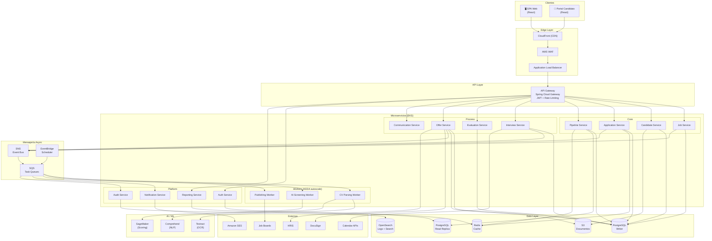

---

## 7. Diagrama C4

### 7.1 Nivel 1 — Contexto del Sistema

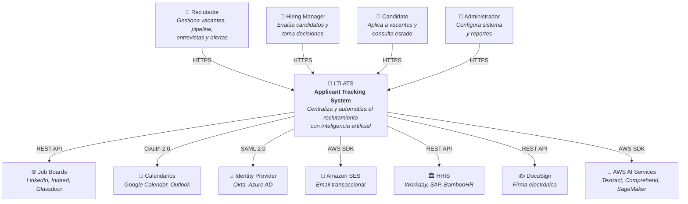

### 7.2 Nivel 2 — Contenedores

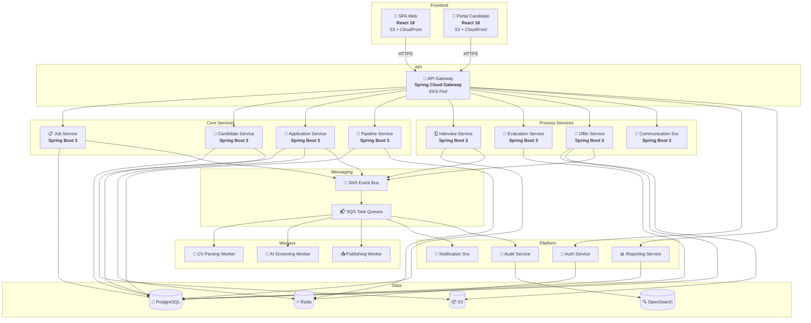

### 7.3 Nivel 3 — Componentes del Application Service

El **Application Service** es el componente de mayor complejidad del sistema. Recibe todas las aplicaciones de candidatos, evalúa killer questions, orquesta el parsing y screening con IA, y gestiona el ciclo de vida de la aplicación a través del pipeline.

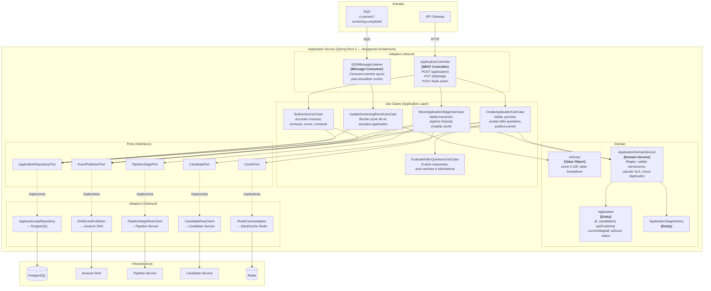

### 7.4 Nivel 4 — Código del CreateApplicationUseCase

```mermaid
classDiagram
    class ApplicationController {
        -CreateApplicationUseCase createUseCase
        -MoveApplicationStageUseCase moveUseCase
        +createApplication(CreateApplicationRequest) ResponseEntity
        +moveStage(UUID, MoveStageRequest) ResponseEntity
        +bulkAction(BulkActionRequest) ResponseEntity
    }

    class CreateApplicationUseCase {
        <<interface>>
        +execute(CreateApplicationCommand) ApplicationResult
    }

    class CreateApplicationUseCaseImpl {
        -ApplicationRepositoryPort applicationRepo
        -CandidatePort candidatePort
        -EventPublisherPort eventPublisher
        -EvaluateKillerQuestionsUseCase killerQuestionsUC
        -ApplicationDomainService domainService
        +execute(CreateApplicationCommand) ApplicationResult
    }

    class CreateApplicationCommand {
        +UUID jobPositionId
        +String email
        +String firstName
        +String lastName
        +UUID documentId
        +String sourceChannel
        +List killerAnswers
    }

    class ApplicationResult {
        +UUID applicationId
        +String status
        +UUID candidateId
        +LocalDateTime appliedAt
    }

    class Application {
        -UUID id
        -UUID candidateId
        -UUID jobPositionId
        -UUID currentStageId
        -BigDecimal aiScore
        -String status
        +receive() void
        +moveToStage(PipelineStage) StageHistory
        +reject(String reason) void
        +updateAIScore(AIScore) void
    }

    class ApplicationRepositoryPort {
        <<interface>>
        +save(Application) Application
        +findById(UUID) Optional
        +existsByCandidateAndJob(UUID, UUID) boolean
    }

    class EventPublisherPort {
        <<interface>>
        +publish(ApplicationReceivedEvent) void
        +publish(StageChangedEvent) void
    }

    class CandidatePort {
        <<interface>>
        +findOrCreateByEmail(String, String, String) UUID
    }

    class ApplicationJpaRepository {
        +save(Application) Application
        +findById(UUID) Optional
    }

    class SNSEventPublisher {
        -SnsClient snsClient
        +publish(ApplicationReceivedEvent) void
    }

    ApplicationController --> CreateApplicationUseCase
    CreateApplicationUseCaseImpl ..|> CreateApplicationUseCase
    CreateApplicationUseCaseImpl --> ApplicationRepositoryPort
    CreateApplicationUseCaseImpl --> CandidatePort
    CreateApplicationUseCaseImpl --> EventPublisherPort
    CreateApplicationUseCaseImpl ..> Application
    ApplicationJpaRepository ..|> ApplicationRepositoryPort
    SNSEventPublisher ..|> EventPublisherPort
```

---
